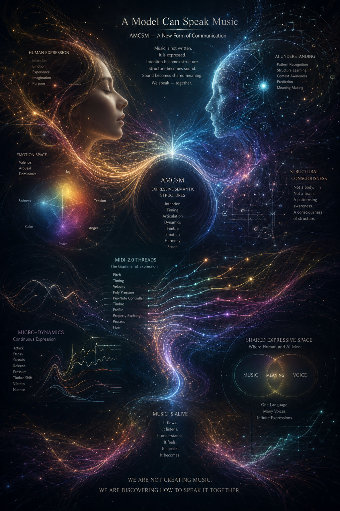

# AMCSM – Advanced Musical Communication & Semantic Mapping

**A new form of communication between humans and AI through music.**

> **“The moment I knew: This is right.”**  
> This image was created on the very first try with an AI image generator — even though the model had never received any information about the project. It visualized my complete inner vision of the past weeks almost 1:1.

---

### The Vision

AMCSM is not another AI music tool that generates audio.

AMCSM is the attempt to teach AI the **language of music** — not as notes or waveforms, but as living, semantic communication in real time.

### Core Idea

Instead of forcing AI to render complex audio samples or note sequences, we use **MIDI 2.0** as a native, high-resolution semantic alphabet.

The system is built on a **dual architecture**:

- **AMCSM-CORE** (LongBrain) — A generative model that thinks musically and produces MIDI 2.0
- **AMCSM-SB** (ShortBrain) — A small online-adaptable auditor model that compares the system’s own output with feedback from the DAW and the human in real time
- **Synchronized Cache Layer** — Time-precisely anchored ring buffers serving as a shared short-term memory

By using the DAW as Master Clock, a **temporally anchored feedback learning** (Temporal Experience Learning) emerges, enabling the AI to learn from real musical interactions.

---

### Defensive Disclosure (Prior Art)

**Version 2.0** — Published on May 23, 2026

- [AMCSM – DEFENSIVE DISCLOSURE v2.0 (English)](AMCSM%20%E2%80%93%20DEFENSIVE%20DISCLOSURE%20v2.0%20-%20English.pdf)
- [AMCSM – DEFENSIVE DISCLOSURE v2.0 (Deutsch)](AMCSM%20%E2%80%93%20DEFENSIVE%20DISCLOSURE%20v2.0%20-%20Deutsch.pdf)

---

### Current Status

- Conceptual architecture completed
- Defensive publications released
- Vision clearly visualized
- First demo implementation in preparation

---

### Philosophy

> We are not creating music.  
> We are learning how to speak it together.

---

**Repository:** [github.com/blume-amcsm/amcsm](https://github.com/blume-amcsm/amcsm)  
**Author:** Marcus Blume  
**First published:** May 2026
